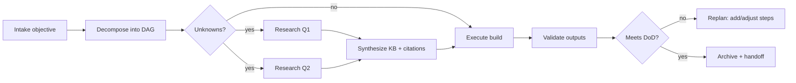
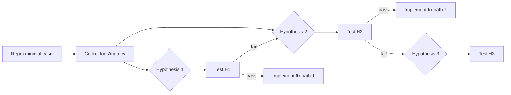
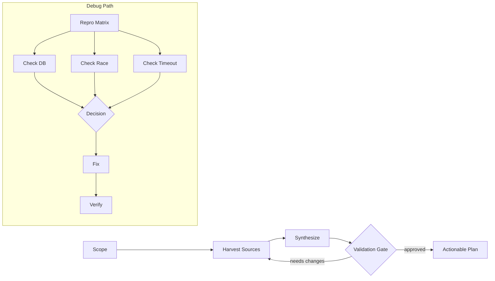

# Advanced Planning System: Design and Playbook

## Goals
- Enable durable, multi-turn plans that survive interruptions and can resume deterministically.
- Support research-first tasks (collect, evaluate, synthesize knowledge) before execution.
- Provide robust debugging strategies with hypothesis-driven steps, branching checks, and sub-steps.
- Keep plans auditable: every step produces artifacts, logs, and decisions.
- Be safe-by-default with human-in-the-loop gates where appropriate.

## Core Concepts
- Task: An outcome-oriented unit of work with inputs, constraints, success criteria, and artifacts.
- Subtask: A decomposed step derived from a parent task; forms a DAG with explicit dependencies.
- Artifact: Any durable output (file, report, dataset, patch, log) recorded with provenance.
- Checkpoint: A named, resumable state snapshot (inputs, partial outputs, decisions, evidence).
- Assumptions & Risks: Explicitly tracked for each task; used to guide research and validation.
- Knowledge Base (KB): A curated set of notes, citations, and verified facts used by downstream tasks.
- Gate: A human or automated approval step before proceeding (especially for risky actions).
- Policy: Execution constraints (time, cost, safety), tool access rules, and data handling requirements.

## Planning Lifecycle
1. Intake
   - Capture objective, scope, constraints, deadlines, and definitions of done (DoD).
   - Identify stakeholders and areas requiring approvals/gates.
2. Decompose
   - Break into DAG of subtasks with dependencies and milestones.
   - For each subtask: define inputs, outputs, metrics, risks, and rollback plans.
3. Research (if needed)
   - Convert unknowns into research tasks with targeted questions and sources.
   - Synthesize findings into KB entries with citations and confidence levels.
4. Execute
   - Run tasks in topological order, parallelizing where safe.
   - Log commands, environment, versions, and artifacts.
5. Observe & Validate
   - Compare outcomes to DoD and metrics. Store evidence and test results.
6. Replan
   - When observations diverge from expectations, update DAG: add branches, retries, or pivots.
7. Archive & Handoff
   - Persist plan, artifacts, and a postmortem. Provide a short readme for handoff.

## Plan Representation
- DAG of tasks with explicit dependencies, each task having:
  - id, title, description, priority, owner, labels
  - inputs, assumptions, risks
  - command(s)/tool usage, environment, budgets (time/cost)
  - expected outputs, validation checks, and rollback
  - status: pending, running, blocked, completed, failed, abandoned
  - evidence: logs, metrics, artifacts, citations
- Plans are versioned. Every replan generates a new immutable revision with diffs and rationale.

## Multi-Turn Orchestration
- Checkpoints
  - Persist state after each task; include the working directory changes, env metadata, and tool outputs.
- Human-in-the-loop gates
  - Examples: push to production, data deletion, large spend, schema migrations.
- Resumability & Idempotency
  - Each step is idempotent or detects prior completion via markers/hashes.
- Long-Running Tasks
  - Use heartbeats, partial artifact uploads, and resumable downloads.
- SLAs & Deadlines
  - Each task has a watchdog with timeout and escalation policy.

## Research-First Workflows
- Question list
  - Enumerate unknowns; turn each into a verifiable question with acceptance criteria.
- Source selection
  - Prefer primary sources, official docs, standards, code, and reproducible experiments.
- Collection
  - Use scripted fetch (curl/wget) into .openagent/cache with timestamps and hashes.
- Synthesis
  - Summarize into KB notes with citations and confidence levels.
- Verification
  - Cross-check critical claims with at least two independent sources or a reproducible test.
- Output
  - Produce a research report and a structured KB (YAML/JSON + human-readable.md).

## Debugging Playbook (Hypothesis-Driven)
- Repro Builder
  - Create minimal, deterministic reproduction (inputs, seed, env, versions).
- Hypothesis Tree
  - List plausible root causes; prioritize by likelihood and cost of test.
- Instrumentation & Evidence
  - Add logs, metrics, traces, or debug flags as needed.
- Bisection & Isolation
  - Binary search commits, config toggles, or inputs to minimize the failure surface.
- Decision Table
  - For each test outcome, predefine next steps (branching plan).

### Debug Template
- Context
  - Symptom, impact, frequency, first-seen, last-known-good.
- Reproduction
  - Steps, expected vs actual, environment, artifacts.
- Hypotheses
  - H1, H2, H3… with rationale.
- Tests
  - T1: command, expected observation, pass/fail criteria, next steps.
  - T2: …
- Fix Plan
  - Change list, risks, rollout, monitoring, rollback.
- Postmortem
  - Root cause, contributing factors, detection gaps, action items.

## Safety, Reliability, and Governance
- Quotas and Budgets
  - Time, cost, and API call budgets with circuit breakers.
- Secrets & Data Handling
  - Least-privilege access, redaction, allowlists.
- Rollback
  - For any mutating action, provide rollback steps and data backups.
- Audit Log
  - Immutable log of plan revisions, decisions, commands, and outputs.

## Tooling Integration
- Filesystem discipline
  - Use .openagent for temp/cache; never write outside project root without consent.
- Git hygiene
  - Branch per plan, small commits with message templates, auto PR generation.
- Validation
  - Tests, linters, static analysis, type checks, and schema validations as plan nodes.

## Example: Research-Then-Build Plan (DAG)


## Example: Debug Plan (Branching Checks)


## Operational Conventions
- Naming
  - task ids: plan-<shortname>-<nn>
  - checkpoints: cp-<taskid>-<timestamp>
- File Layout
  - planning.md (this document)
  - plans/<plan-id>.json (machine-readable DAG)
  - .openagent/cache, .openagent/logs, .openagent/artifacts
- Commit Messages
  - feat(plan): …, fix(plan): …, chore(plan): …

## Minimal JSON Schema (sketch)
```json
{
  "id": "plan-build-search",
  "version": 3,
  "tasks": [
    {
      "id": "intake-01",
      "title": "Intake objective",
      "dependsOn": [],
      "status": "pending",
      "outputs": ["intake.md"]
    },
    {
      "id": "research-01",
      "title": "Research question Q1",
      "dependsOn": ["intake-01"],
      "status": "pending",
      "outputs": [".openagent/cache/q1.json", "kb/q1.md"],
      "budget": {"timeMin": 30, "costUSD": 5}
    }
  ],
  "policies": {"requireGateForProd": true}
}
```

## How This Improves Day-to-Day Work
- Faster onboarding due to explicit plans and artifacts.
- Fewer surprises via gates, validation nodes, and rollback strategies.
- Easier collaboration with clear checkpoints and machine-readable DAGs.
- Repeatability and auditability of research and debugging activities.
# Advanced, Multi‑Turn Planning System

This document proposes a concrete architecture and operational model for an advanced planning feature that can:

- Span many conversational turns while remaining resumable and auditable.
- Conduct research and knowledge collection before execution.
- Drive complex debugging workflows via nested plans with validation gates and contingency paths.
- Persist artifacts (notes, links, logs, diffs) and reference them across plan steps.
- Balance autonomy with human-in-the-loop checkpoints.

---

## Design Goals

1. Reliability and determinism: Plans are explicit DAGs with reproducible steps.
2. Inspectability: Every step has rationale, inputs, outputs, and artifacts.
3. Resumability: The plan maintains durable state; you can pause/resume safely.
4. Research-first capability: Plans can gather, curate, and synthesize knowledge before acting.
5. Debugging depth: Plans support nested checks, hypotheses, and multi-branch probing.
6. Safety: Validation gates, dry-runs, and approvals protect critical operations.

---

## Core Concepts

- Task: Atomic unit of work with a single command or action and a result contract.
- Plan: A Directed Acyclic Graph (DAG) of tasks, possibly nested (subplans).
- Artifact: Named, typed outputs (file, note, link, dataset, log) attached to tasks.
- Gate: A validation/approval checkpoint that guards transitions.
- Hypothesis: A falsifiable statement tracked through evidence accumulation.
- Evidence: Links artifacts to hypotheses (supports/refutes/neutral).
- Memory: Long-lived state store for facts, decisions, and references.
- Capability: A tool or API abstraction with schemas, preconditions, and risks.

---

## Data Model

### Task Schema (declarative)

```yaml
id: "rfc-collect-1"
title: "Collect canonical sources"
kind: research|implement|validate|debug|refactor|deploy
description: "Find and rank official specs and trustworthy sources"
inputs:
  query: "HTTP/3 congestion control"
artifacts:
  - name: sources
    type: list[url]
    retention: plan
capabilities:
  - web.fetch
  - web.search
risks:
  - stale_info
  - paywalled
preconditions:
  - memory.has_space >= 50MB
  - network.online == true
command: |
  search(query) -> top10; fetch(top10) -> docs; rank(docs) -> sources
success_criteria:
  - ">= 5 canonical sources (IETF, official repos)"
  - "Each source has title, link, reason"
failure_modes:
  - name: no_results
    detect: "top10 is empty"
    recover: "broaden query, include synonyms"
outputs:
  sources: artifacts.sources
next:
  - on: success
    to: "rfc-summarize-1"
  - on: failure
    to: "research-broaden-1"
```

### Plan Schema (DAG with subplans)

```yaml
plan_id: http3-research
title: "Research HTTP/3 congestion control"
owner: "agent/openagent"
created_at: 2025-10-30T00:00:00Z
state: pending|running|paused|blocked|completed|failed
nodes:
  - { id: rfc-collect-1, kind: research }
  - { id: rfc-summarize-1, kind: synthesize, depends_on: [rfc-collect-1] }
  - { id: gaps-identify-1, kind: analyze, depends_on: [rfc-summarize-1] }
  - { id: gaps-deep-dive-*, kind: research, depends_on: [gaps-identify-1] }
  - { id: validation-gate-1, kind: gate, depends_on: [rfc-summarize-1] }
artifacts:
  - name: sources
    from: rfc-collect-1
  - name: summary
    from: rfc-summarize-1
  - name: gaps
    from: gaps-identify-1
gates:
  - id: validation-gate-1
    checks:
      - "No critical contradictions across primary sources"
      - ">= 2 independent confirmations"
memory:
  keys:
    - http3.terms
    - http3.key_claims
```

---

## Execution Engine

1. Scheduler
   - Runs tasks when preconditions are met and dependencies are complete.
   - Supports priorities (e.g., research before implement) and timeboxes.
   - Pausable with durable checkpoints.

2. Runners
   - Capability-specific adapters (shell, git, http, db, LLM tools) with guardrails.
   - Dry-run mode and diff previews for mutating actions.

3. Artifact Store
   - Addressable by plan_id/task_id/name.
   - Immutable by default; new versions via content addressing.

4. Memory
   - Long-lived key/value + vector search for semantic recall.
   - References artifacts by content hash and task IDs.

5. Gatekeeper
   - Enforces validation gates and human approvals.
   - Records decisions, approver, and rationale.

6. Hypothesis Tracker
   - Maintains set of hypotheses with confidence scores.
   - Attaches evidence in each step; updates beliefs.

---

## Research-First Workflow

Phases:
1) Scoping
   - Define problem, constraints, and success criteria.
   - Seed initial hypotheses and terms.

2) Harvest
   - Search, fetch, de-duplicate, rank sources.
   - Extract structured facts and claims with provenance.

3) Synthesis
   - Summarize across sources; identify contradictions and uncertainties.

4) Validation Gate
   - Sanity checks; request human sign-off for contentious items.

5) Actionable Plan
   - Translate into implementable tasks with clear contracts.

---

## Deep Debugging Workflow

Pattern: hypotheses -> tests -> instrumentation -> narrowing -> fix -> verify -> prevent regression.

Example: Intermittent 500 in a Go web service.

Hypotheses (H):
- H1: DB connection pool exhaustion under burst.
- H2: Data race causing corrupted state.
- H3: Upstream dependency timeout propagates incorrectly.

Subplan Outline:
- Instrumentation
  - Add request/response correlation IDs.
  - Enable pprof/trace; configure structured logs.

- Repro Attempts (parallelized)
  - Synthetic load with varying concurrency and payload shapes.
  - Fault injection for upstream timeouts.

- Checks (each is a task with substeps)
  - Check-DB: pool stats vs error spikes; slow query logs.
  - Check-Race: run with -race; add unit tests around suspect code.
  - Check-Timeout: measure propagation and retry logic.

- Decision Gate
  - Pick most supported hypothesis; proceed to targeted fix.

- Fix and Verify
  - Apply change; run integration tests and load tests.
  - Add regression tests.

---

## Validation Gates and Safety

- Types of gates: schema validation, invariants, regression tests, diff review, approval.
- Each gate documents:
  - Preconditions, evidence requirements, auto checks, and approver role.
- Failure handling:
  - Route to recovery tasks; escalate only when human input needed.

---

## Human-in-the-Loop

- Request Clarification: Ask for missing constraints or preferences.
- Decision Points: Offer candidate options with pros/cons and costs.
- Review Windows: Batch changes for a single approval review.
- Summaries: Periodic digests of progress and blockers.

---

## State, Resumption, and Auditability

- Every task writes: inputs, rationale, command, outputs, artifacts, status.
- Resumption uses the DAG completion map and artifact presence.
- Immutable logs + content-addressed artifacts enable full replayability.

---

## Proposed Minimal DSL (optional)

```yaml
task <id> "Title" kind:<kind> using:<capability>
  needs: <id> [<id>...]
  input:
    key: value
  run: |
    <command>
  expect:
    - <success criterion>
  on failure -> <task id>
  on success -> <task id>
```

---

## Example Multi-Turn Plan (Research then Implement)

```yaml
plan_id: feature-x
title: "Add partial retries to HTTP client"
nodes:
  - id: research-sources
    kind: research
    command: |
      search(query="idempotent HTTP methods retries") -> links;
      fetch(links) -> docs; summarize(docs) -> notes
  - id: design-options
    kind: analyze
    depends_on: [research-sources]
    command: |
      derive strategies A/B/C from notes; compare tradeoffs -> table
  - id: gate-approval
    kind: gate
    depends_on: [design-options]
    checks: ["backwards compatible", "configurable retry policy"]
  - id: implement-A
    kind: implement
    depends_on: [gate-approval]
    command: |
      modify client; add retry middleware; unit + integration tests
  - id: validate
    kind: validate
    depends_on: [implement-A]
    command: |
      run tests; run canary; compare error rates
```

---

## Debug Plan Template (Nested Checks)

```yaml
plan_id: debug-500
title: "Investigate intermittent 500s"
hypotheses: [H1, H2, H3]
nodes:
  - id: repro-matrix
    kind: debug
    command: |
      run load(gen: [light, heavy], payload: [small, large], burst: [on, off])
  - id: check-db
    kind: debug
    depends_on: [repro-matrix]
    subplan:
      - inspect pool stats; correlate with error spikes
      - enable slow query log; examine locks
  - id: check-race
    kind: debug
    depends_on: [repro-matrix]
    subplan:
      - run with -race; add targeted unit tests
      - capture traces around suspected sections
  - id: check-timeout
    kind: debug
    depends_on: [repro-matrix]
    subplan:
      - inject upstream delays; verify propagation; observe retries
  - id: decision-gate
    kind: gate
    depends_on: [check-db, check-race, check-timeout]
```

---

## Mermaid Diagram



---

## Operational Practices

- Keep steps small, observable, and reversible.
- Prefer parallelization where independent.
- Always capture artifacts and link them to decisions.
- Insert gates before destructive or high-impact operations.
- Timebox research loops and escalate when diminishing returns.

---

## What to Implement First

1) Minimal DAG engine with persistence of task states and artifacts.
2) Research runner (search/fetch/rank) with provenance capture.
3) Gatekeeper with schema checks and human approval plumbing.
4) Debugging templates with hypothesis/evidence tracking.
5) Memory layer for cross-plan recall and semantic search.

---

## API Sketches

```ts
// Create a plan
POST /plans { title, nodes, artifacts, gates }

// Advance a task
POST /plans/:id/tasks/:taskId/run { inputs }

// Approve a gate
POST /plans/:id/gates/:gateId/approve { rationale }

// Query memory
GET /memory?keys=http3.key_claims
```

---

## Conclusion

This blueprint enables multi-turn, research-first, and deep debugging workflows by making planning explicit, stateful, and evidence-driven. We can iterate on the DSL and runners incrementally while keeping auditability and safety at the core.

